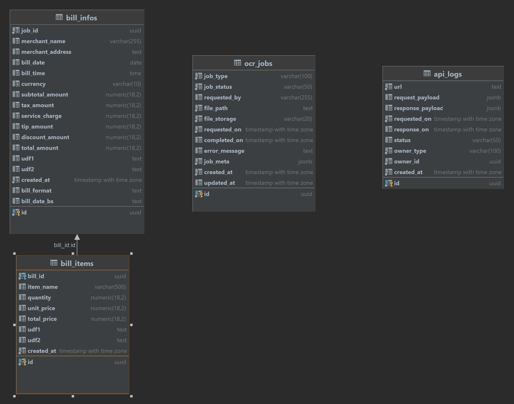

# OCR Invoice Extraction System

Async OCR pipeline that extracts structured billing data from invoice images using Node.js, Kafka, Redis, and PostgreSQL.

## Prerequisites

Docker only.

## Setup

```bash
git clone <repository-url> && cd ocr-extraction
npm install
cp .env.example .env
docker-compose up --build
```

On first run: DB tables, Kafka topic `ocr.processing`, and MinIO bucket `uploads` are created automatically.

| Service    | URL / Port              | Credentials               |
|------------|-------------------------|---------------------------|
| API        | http://localhost:3000   |                           |
| MinIO UI   | http://localhost:9001   | minioadmin / minioadmin   |
| PostgreSQL | localhost:5432          | appuser / AppUser@2025@   |
| Redis      | localhost:6379          | Redis123                  |
| Kafka      | localhost:29092         |                           |

## Development

```bash
npm run build && npm run dev
```
### Database Schema Design
### bill_infos

| Column Name      | Data Type | Remarks                                                                                                                                  |
|------------------|-----------|------------------------------------------------------------------------------------------------------------------------------------------|
| id               | uuid | Primary key of the bill record.                                                                                                          |
| job_id           | uuid | References the OCR job that generated this bill data. Used to link extracted bill information with the processing job.                   |
| merchant_name    | varchar(255) | Name of the merchant/vendor from the bill.                                                                                               |
| merchant_address | text | Address of the merchant extracted from the bill.                                                                                         |
| bill_date        | date | Date printed on the bill.                                                                                                                |
| bill_time        | time | Time printed on the bill.                                                                                                                |
| currency         | varchar(10) | Currency code of the bill amount (e.g., USD, NPR, EUR).                                                                                  |
| subtotal_amount  | numeric(18,2) | Total amount before taxes, service charges, discounts, etc.                                                                              |
| tax_amount       | numeric(18,2) | Tax amount charged on the bill.                                                                                                          |
| service_charge   | numeric(18,2) | Service charge applied to the bill.                                                                                                      |
| tip_amount       | numeric(18,2) | Tip or gratuity amount.                                                                                                                  |
| discount_amount  | numeric(18,2) | Discount deducted from the bill.                                                                                                         |
| total_amount     | numeric(18,2) | Final payable amount after all additions and deductions.                                                                                 |
| udf1             | text | User-defined/custom field for future extensions.                                                     |
| udf2             | text | User-defined/custom field for future extensions.                                                                                         |
| bill_format      | text | Identified bill template or format type used during OCR processing. seperates different kind of invoice. (eg. DEVNAGARI, ENGLISH, OTHERS) |
| bill_date_bs     | text | stores dates that are devnagari specific.                                                                                                |

| created_at | timestamp with time zone | Timestamp when the bill record was created. |

---

### bill_items

| Column Name | Data Type | Remarks |
|------------|-----------|----------|
| id | uuid | Primary key of the bill item record. |
| bill_id | uuid | Foreign key referencing `bill_infos.id`. Associates item with a specific bill. |
| item_name | varchar(500) | Name/description of the purchased item. |
| quantity | numeric(18,2) | Quantity of the item purchased. |
| unit_price | numeric(18,2) | Price per unit of the item. |
| total_price | numeric(18,2) | Total price for the item (`quantity × unit_price`). |
| udf1 | text | User-defined/custom field for additional item metadata. |
| udf2 | text | User-defined/custom field for additional item metadata. |
| created_at | timestamp with time zone | Timestamp when the item record was created. |

---

### ocr_jobs

| Column Name | Data Type | Remarks                                                                                                           |
|------------|-----------|-------------------------------------------------------------------------------------------------------------------|
| id | uuid | Primary key of the OCR job.                                                                                       |
| job_type | varchar(100) | Type of job according to ocr extractor (e.g., VEDAS_STUDIO_EXTRACTOR, OWN, others).                               |
| job_status | varchar(50) | Current processing status (Pending, Processing, Completed, Failed, etc.).                                         |
| requested_by | varchar(255) | User, system, or service that initiated the OCR request.                                                          |
| file_path | text | Storage path or location of the uploaded file.                                                                    |
| file_storage | varchar(20) | Storage provider/type (e.g., Local, S3, MinIO, Azure Blob).                                                       |
| requested_on | timestamp with time zone | Timestamp when OCR processing was requested.                                                                      |
| completed_on | timestamp with time zone | Timestamp when OCR processing completed.                                                                          |
| error_message | text | Error details if OCR processing failed.                                                                           |
| job_meta | jsonb | Additional metadata related to the OCR job, stored as JSON. Original filenames and other metadata are stored here |
| created_at | timestamp with time zone | Record creation timestamp.                                                                                        |
| updated_at | timestamp with time zone | Last update timestamp.                                                                                            |

---

### api_logs

| Column Name | Data Type | Remarks                                                                     |
|------------|-----------|-----------------------------------------------------------------------------|
| id | uuid | Primary key of the API log record.                                          |
| url | text | API endpoint URL that was invoked.                                          |
| request_payload | jsonb | Complete request body sent to the API. Useful for debugging and auditing.   |
| response_payload | jsonb | Response body returned by the API.                                          |
| requested_on | timestamp with time zone | Timestamp when the API request was received.                                |
| response_on | timestamp with time zone | Timestamp when the API response was returned.                               |
| status | varchar(50) | API execution status (Success, Failed, Error, Timeout, etc.).               |
| owner_type | varchar(100) | Entity type associated with the API call (e.g., OCR_JOB, BILL, SYSTEM).     |
| owner_id | uuid | Identifier of the associated entity record. (Eg: Job Id for owner type Job) |
| created_at | timestamp with time zone | Timestamp when the log entry was created.                                   |

---

### Relationships

| Parent Table | Child Table | Relationship | Description |
|-------------|------------|-------------|-------------|
| ocr_jobs.id | bill_infos.job_id | One-to-Many | One OCR job can produce one or more extracted bill records. |
| bill_infos.id | bill_items.bill_id | One-to-Many | One bill can contain multiple line items/products. |
| api_logs.owner_id | Various Entities | Polymorphic | API logs can be associated with OCR jobs, bills, or other entities based on `owner_type`. |


#### Entity Relationship Diagram



## API Reference

### `POST /api/v1/ocr/upload`
Upload 1–5 invoice images (JPEG/PNG, max 10MB each) for async OCR processing.

```bash
curl -X POST http://localhost:3000/api/v1/ocr/upload \
  -F "files=@invoice1.jpg" -F "files=@invoice2.png"
```

Returns `HTTP 202` with an array of `{ jobId, message }` objects.

---

### `GET /api/v1/ocr/jobs/:jobId`
Poll current job status. Returns `{ jobId, status, completedOn, errorMessage }`.

| Status | Description |
|--------|-------------|
| `PENDING` | Waiting in Kafka queue |
| `PROCESSING_STARTED` | Consumer picked up the message |
| `FETCHING_FILE` | Retrieving image from storage |
| `EXTRACTING_TEXT` | Calling OCR API |
| `TRANSFORMING_DATA` | Normalizing response |
| `SAVING_DATA` | Persisting to DB |
| `COMPLETED` | Done |
| `FAILED` | See `errorMessage` |

---

### `GET /api/v1/ocr/jobs/:jobId/stream`
Real-time status via Server-Sent Events. Stream closes on terminal status or after 5 minutes.

| Event | When | Payload |
|-------|------|---------|
| `status` | On connect + every ~2s | `{ jobId, status, completedOn, errorMessage }` |
| `done` | Terminal status reached | `{ jobId }` |
| `error` | Poll error or timeout | `{ jobId, message }` |

```javascript
const es = new EventSource(`/api/v1/ocr/jobs/${jobId}/stream`);
es.addEventListener('status', (e) => console.log(JSON.parse(e.data)));
es.addEventListener('done', () => es.close());
es.addEventListener('error', (e) => { console.error(e); es.close(); });
```

---

## Architecture Decisions

**Abstract OCR processor** — `OcrProcessorAbstract<TFile, TRawOcrResponse>` defines a fixed pipeline (`fetchJob → updateJobStatus → fetchFile → extractText → transformData → saveExtractedData`). Infrastructure steps are concrete; provider-specific steps (`fetchFile`, `extractText`, `transformData`, `saveExtractedData`) are abstract. New providers extend the class, implement four methods, and register in `OcrProcessorRegistry`. Follows Open/Closed Principle.

**Kafka for async processing** — HTTP returns `202` immediately; OCR (5–20s) runs in a separate consumer. `autoCommit: false` prevents message loss on crash. `sessionTimeout: 60s` avoids spurious rebalances during long jobs. Consumer and producer scale independently.

**SSE for status streaming** — unidirectional push fits job status updates; no WebSocket overhead. Polls Redis every 2s; DB queried only on cache miss or terminal status. 3-minute safety timeout prevents stale connection leaks.

**Upload-first job creation** — file is stored before the DB record is created, so the job is inserted with the final `file_path` in a single write. Eliminates the `UPDATE filePath` step and prevents orphaned records on upload failure. `redisSet` and `producer.publishOcrJob` run in parallel via `Promise.all`.

**Response normalization** — `normalizeVedasResponse()` handles inconsistent field names (`merchant_name` vs `merchantName`), envelope variance, and Devanagari Unicode digits. BS dates stored in `bill_date_bs` (varchar) for display; converted AD date in `bill_date` (date) for queries.

**Pluggable storage** — `STORAGE_TYPE` env var selects `local` (dev) or `minio` (prod) at runtime with no code changes.

**Cache-first status reads** — Redis serves intermediate statuses; terminal statuses fall through to PostgreSQL for full details. Every DB read warms the cache. TTL: 24 hours.

---

## Assumptions & Trade-offs

- BS dates outside lookup range stored as `null` (don't fail the job)
- Both BS and AD dates persisted (display vs. query needs)
- File cleanup is a manual API call, not scheduled (preserves files for reprocessing/audit)
- One Kafka partition in dev; production should use more for throughput
- One message processed per consumer instance; scale out with multiple instances
- `requestedBy` hardcoded to `"SYSTEM"` (auth/multi-tenancy out of scope)
- All Vedas API calls logged regardless of outcome

---

## Known Limitations

- No retry mechanism — failed jobs must be resubmitted manually
- SSE timeout requires a new client connection (no `Last-Event-ID` support)
- MinIO bucket must exist before use — not auto-created when `STORAGE_TYPE=minio`
- Kafka offsets are auto-committed; manual commit + DLQ would improve reliability
- SSE polls Redis every 2s — Redis Pub/Sub would be more efficient
